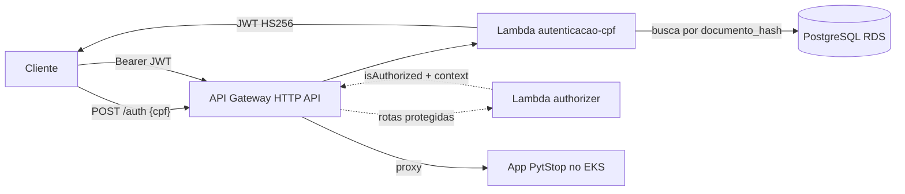

# postech-sw-arch-p3-lambda — Autenticação por CPF (PytStop)

Function serverless de autenticação da fase 3 do Tech Challenge (PytStop, oficina mecânica). O cliente informa o CPF; a function valida o formato, verifica existência e status na base do app e emite um JWT compatível com o app principal ([postech-sw-arch-p3](https://github.com/fiap-postech-sw-architecture/postech-sw-arch-p3)).

Decisões de arquitetura: ADRs 026–029 no repo principal (`postech-sw-arch-p3/docs/arquitetura/adr/fase3/`).

## Tecnologias

- **Python 3.13** (runtime `python3.13` da AWS Lambda) com [uv](https://docs.astral.sh/uv/)
- **AWS Lambda** + **API Gateway HTTP API** (rota `POST /auth` + Lambda authorizer nas rotas protegidas)
- **PyJWT** (HS256, mesmos claims do app), **psycopg** (PostgreSQL), **brutils** (validação de CPF, ADR-010)
- **Terraform** (deploy real — a IaC da function e do gateway vive NESTE repo)
- **AWS SAM CLI** (apenas emulação local, ADR-029)
- Qualidade: ruff, mypy (strict), bandit, pytest com cobertura ≥ 95%, testcontainers
- Dockerfile: n/a — deploy é pacote zip via Terraform (ADR-029), sem imagem de container

## Arquitetura



Compatibilidade com o app (replicada bit a bit, com teste de paridade):

- Normalização do CPF: apenas dígitos (mesma regra do VO `CPF` do app).
- Busca: `documento_hash = HMAC-SHA256(key=sha256(ENCRYPTION_KEY), msg=cpf_normalizado)` na tabela `clientes`.
- JWT: claims `sub`, `email`, `papel="cliente"`, `type="access"`, `jti`, `iat`, `exp`, assinado com o mesmo `JWT_SECRET` — validado sem mudança pelo app.
- Anti-enumeração: cliente inexistente e inativo recebem a mesma resposta `401`.

## Rodando local

```bash
uv sync            # instala Python 3.13 + dependências
make check         # lint + typecheck + security + testes (cobertura >= 95%)
make test-integ    # testes de integração com PostgreSQL real (exige Docker)
make sam-local     # emulação da API local (exige SAM CLI; ADR-029)
sam local invoke AutenticacaoCpfFunction -e events/auth.json
```

Variáveis de ambiente da function: `DATABASE_URL`, `JWT_SECRET`, `ENCRYPTION_KEY` (obrigatórias — ausência aborta o cold start) e `JWT_EXPIRATION_MINUTES` (default 30).

### Demo local integrada (lambda + app no kind)

Fluxo completo CPF→JWT→API sem AWS, com o app do repo principal rodando no kind (`make cd-local` lá):

```bash
# 1. App + banco no kind (repo postech-sw-arch-p3):
#    make cd-local  — sobe cluster, banco, API e monitoramento.
# 2. Exponha o Postgres do cluster para a lambda local (15432 evita colisão
#    com um Postgres local ou do compose da fase 2 em 5432):
kubectl --context kind-pytstop -n pytstop-infra port-forward svc/postgres 15432:5432 &
# 3. Env de demo da lambda (mesmos JWT_SECRET/ENCRYPTION_KEY dos Secrets de
#    demo do app em k8s/secret.yaml):
cp env.json.example env.json
# 4. Emule gateway + function apontando para o MESMO banco e segredos do app
#    (o alvo roda `make build-local` antes — o template usa deps de build/lambda-local):
make sam-local     # POST http://localhost:3000/auth {"cpf": "<cpf de cliente semeado>"}
# 5. Consuma a API do app com o token emitido:
#    curl -H "Authorization: Bearer <token>" http://localhost:8000/api/v1/...
```

> **Nota (demo only)**: os valores de `env.json.example` são os segredos de
> demonstração PÚBLICOS do app (`k8s/secret.yaml` do repo principal, marcados
> `gitleaks:allow` lá) — nunca valores reais. `env.json` está no `.gitignore`
> para o caso de alguém trocar por valores próprios.

O SAM emula localmente apenas o `POST /auth`. As rotas de cliente são chamadas diretamente no app local, pois o proxy HTTP para o EKS existe somente na AWS. O authorizer é coberto pelos testes unitários locais e pelos smokes do API Gateway na AWS.

## Deploy (Terraform + AWS Academy)

Restrições do AWS Academy: sem criação de recursos IAM. O ARN da `LabRole` existente é formado com o account ID retornado pelo STS, evitando `iam:GetRole`. As credenciais rotativas usam a cadeia padrão, sempre em `us-east-1`.

```bash
make build                             # empacota deps (wheels linux) + src em build/lambda/
cd terraform
terraform init
terraform apply \
  -var jwt_secret=... -var encryption_key=... -var database_url=... \
  -var app_listener_arn=arn:aws:elasticloadbalancing:us-east-1:...:listener/net/...
```

Um único state remoto no bucket `pytstop-terraform-state-924563550535`, chave `lambda/terraform.tfstate`, com versionamento e lock nativo (`use_lockfile`). Sem workspaces: os stages `homolog` e `prod` existem na mesma HTTP API e as functions têm nome fixo. Não execute Terraform local enquanto o CD deste repositório estiver rodando.

Apenas a Lambda de autenticação entra nas subnets públicas originais da VPC default, selecionadas por `default-for-az=true`, para consultar o RDS na porta 5432. O authorizer permanece fora da VPC, pois valida o JWT sem acessar o banco.

As rotas de cliente compartilham uma integração HTTP proxy privada. O Terraform descobre as duas subnets pela tag `kubernetes.io/role/internal-elb=1`, cria o VPC Link com saída restrita à porta 8000 e recebe o listener do NLB interno por `app_listener_arn`. O parameter mapping `overwrite:path = $request.path` remove o prefixo do stage antes de encaminhar a requisição ao FastAPI. No CD, configure o secret `TF_VAR_APP_LISTENER_ARN`.

Provisione na ordem `infra-k8s → app/NLB → lambda`: após cada recriação do NLB, obtenha o novo ARN do listener TCP 8000 e atualize `TF_VAR_APP_LISTENER_ARN` antes do deploy deste repositório. Na desmontagem, destrua primeiro Lambda/Gateway/VPC Link, depois app/NLB e por último EKS/subnets privadas, evitando ENIs ainda anexadas.

O CD (`.github/workflows/cd.yml`) roda `make check` antes do deploy e aplica o mesmo Terraform em push para `homolog` e `main`; o que muda por branch é só qual stage o resumo referencia. Ver a nota sobre credenciais rotativas no topo do arquivo e o runbook `aws-academy-setup.md` no repo `postech-sw-arch-p3-docs`.

## API

| Método | Rota | Descrição |
|---|---|---|
| POST | `/auth` | `{"cpf": "..."}` → `200 {access_token, token_type, expires_in}` \| `400` CPF malformado \| `401` credenciais inválidas |
| GET | `/api/v1/minhas-ordens` | Lista as ordens do cliente autenticado; proxy HTTP para o app no EKS, protegido pelo authorizer |
| GET | `/api/v1/minhas-ordens/{ordem_id}` | Consulta uma ordem pertencente ao cliente; retorna `404` para ordem de outro cliente |

Documentação completa (Swagger/Postman): [collection Postman da fase 3](https://github.com/fiap-postech-sw-architecture/postech-sw-arch-p3/blob/main/docs/entrega/fase3/postman-collection-fase3.json) (inclui esta rota `POST /auth` com a variável `gateway_url`) e [OpenAPI da API principal](https://github.com/fiap-postech-sw-architecture/postech-sw-arch-p3/blob/main/docs/entrega/fase3/openapi-fase3.json).

## Status e pendências

- [x] Function + authorizer implementados, gate local verde (lint, mypy strict, bandit, cobertura ≥ 95%, terraform validate/test, `sam validate --lint`)
- [x] Deploy real na AWS: [CD automático de produção](https://github.com/fiap-postech-sw-architecture/postech-sw-arch-p3-lambda/actions/runs/34179043515) verde em 07/09/2026
  - Endpoint atual: `https://rs6lbkn7p4.execute-api.us-east-1.amazonaws.com/prod`
  - Smoke: `POST /auth` = 200; rota protegida = 200 com token e 401 sem token
