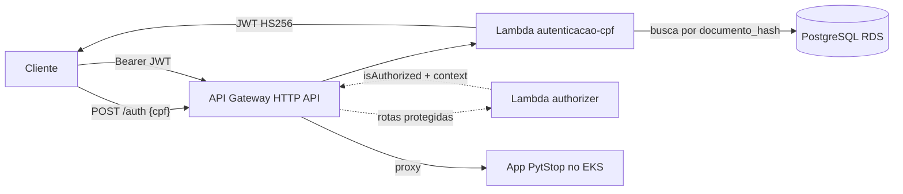

# postech-sw-arch-p3-lambda — Autenticação por CPF (PytStop)

Function serverless de autenticação da fase 3 do Tech Challenge (PytStop, oficina mecânica). O cliente informa o CPF; a function valida o formato, verifica existência e status na base do app e emite um JWT compatível com o app principal ([postech-sw-arch-p3](https://github.com/fiap-postech-sw-architecture/postech-sw-arch-p3)).

Decisões de arquitetura: ADRs 026–029 no repo principal (`postech-sw-arch-p3/docs/adr/`).

## Tecnologias

- **Python 3.13** (runtime `python3.13` da AWS Lambda) com [uv](https://docs.astral.sh/uv/)
- **AWS Lambda** + **API Gateway HTTP API** (rota `POST /auth` + Lambda authorizer nas rotas protegidas)
- **PyJWT** (HS256, mesmos claims do app), **psycopg** (PostgreSQL), **brutils** (validação de CPF, ADR-010)
- **Terraform** (deploy real — a IaC da function e do gateway vive NESTE repo)
- **AWS SAM CLI** (apenas emulação local, ADR-029)
- Qualidade: ruff, mypy (strict), bandit, pytest com cobertura ≥ 95%, testcontainers

## Arquitetura



Compatibilidade com o app (replicada bit a bit, com teste de paridade):

- Normalização do CPF: apenas dígitos (mesma regra do VO `CPF` do app).
- Busca: `documento_hash = HMAC-SHA256(key=sha256(ENCRYPTION_KEY), msg=cpf_normalizado)` na tabela `clientes`.
- JWT: claims `sub`, `email`, `papel="cliente"`, `type="access"`, `jti`, `iat`, `exp`, assinado com o mesmo `JWT_SECRET` — validado sem mudança pelo app.
- Anti-enumeração: cliente inexistente e inativo recebem a mesma resposta `401`.

## Rodando local

```bash
uv sync            # instala Python 3.13 + dependências
make check         # lint + typecheck + security + testes (cobertura >= 95%)
make test-integ    # testes de integração com PostgreSQL real (exige Docker)
make sam-local     # emulação da API local (exige SAM CLI; ADR-029)
sam local invoke AutenticacaoCpfFunction -e events/auth.json
```

Variáveis de ambiente da function: `DATABASE_URL`, `JWT_SECRET`, `ENCRYPTION_KEY` (obrigatórias — ausência aborta o cold start) e `JWT_EXPIRATION_MINUTES` (default 30).

## Deploy (Terraform + AWS Academy)

Restrições do AWS Academy: sem criação de recursos IAM (usa a role `LabRole` existente via data source), credenciais rotativas no profile `academy`, região `us-east-1`.

```bash
make build                             # empacota deps (wheels linux) + src em build/lambda/
cd terraform
terraform init
terraform workspace select -or-create homolog   # ou prod
terraform apply \
  -var jwt_secret=... -var encryption_key=... -var database_url=...
```

O CD (`.github/workflows/cd.yml`) faz o mesmo em push para `homolog` (stage homolog) e `main` (stage prod) — ver nota sobre cota/credenciais no topo do arquivo e o runbook `aws-academy-setup.md` no repo `postech-sw-arch-p3-docs`.

## API

| Método | Rota | Descrição |
|---|---|---|
| POST | `/auth` | `{"cpf": "..."}` → `200 {access_token, token_type, expires_in}` \| `400` CPF malformado \| `401` credenciais inválidas |

Documentação completa (Swagger/Postman): ver o repo principal [postech-sw-arch-p3](https://github.com/fiap-postech-sw-architecture/postech-sw-arch-p3) (placeholder — collection será publicada junto com a entrega da fase 3).

## Status e pendências

- [x] Function + authorizer implementados, gate local verde (lint, mypy strict, bandit, cobertura ≥ 95%, terraform validate)
- [ ] Deploy real na AWS — **aguardando credenciais AWS Academy** (rotativas por sessão de laboratório)
- [ ] Execução do CI/CD no GitHub — **cota de Actions da organização esgotada** (gate roda local via `make gate`)
- [ ] Integração das rotas protegidas do gateway com o app no EKS (hoje há uma rota de exemplo com o authorizer)
